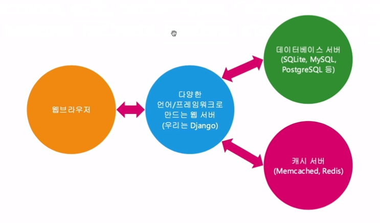
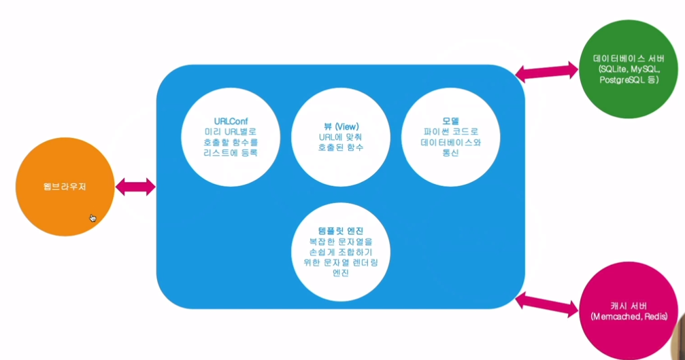

# ch02) 장고
**01-파이썬 설치(윈도우)**

파이썬 설치

아나콘다 설치

conda create --name askcompany python=3.7

conda activate askcompany

django~=3.0.0 설치

**02-Visual Studio Code 설치**

vscode 설치

python extensions 설치

**03-장고 프로젝트 생성**

아래 명령어로 django 프로젝트 생성

django-admin startproject 프로젝트이름

프로젝트이름으로 폴더명이 만들어진다.

**내부 파일 안내**

manage.py: 명령행을 통해 각종 장고 명령 수행

askcompany 폴도: 프로젝트명으로 생성된 디렉토리, 최상위 폴더와는 다르게 이 이름을 참조하고 있는 코드가 있기 때문에 함부로 수정하면 안된다.

_ _ init _ _.py

settings.py

urls.py: 최상위 urls.py

wsgi.py: 실서비스에서의 웹서비스 진입점

이후 실행한 명령어

python manage.py migrate

python manage.py createcuperuser

python manage.py runserver

**04-장고 주요 구성요소**

주요 기능들

* FUnction Based Views: 함수로 HTTP 요청 처리
* Models: 데이터베이스와으 인터페이스
* Templates: 복잡한 문자열 조합을 보다 용이하게, 주로 HTML 문자열 조합 목적으로 사용하지만, 푸쉬 메세지나 이메일 내용을 만들 때에도 쓰면 편리
* Admin 기초: 심플한 데이터베이스 레코드 관리 UI
* Logging: 다양한 경로로 메세지 로깅
* Static files: 개발 목적으로의 정적인 파일 관리
* Messages framework: 유저에게 1회성 메세지 노출 목적
* Class Based Views: 클래스로 함수 기반 뷰 만들기
* Forms: 입력폼 생성, 입력값 유효성 검사 및 DB로의 저장(validators, Fields, Widgets)
* 테스팅
* 국제화&지역화
* 캐싱
* Geographic: DB의 Geo기능 활용(PostgreSQL 중심)
* Sending Emails
* Syndication Feeds(RSS/Atom)
* Sitemaps

웹 애플리케이션 기본 구조

장고 기본 구조(위의 웹 애플리케이션 기본 구조에서 파란색 부분을 확대)

**05-장고앱과 블로그 코딩쇼**

* 장고 앱의 필요성

현재 프로젝트의 블로그 기능을 다른 프로젝트에서도 사용하려 한다면?

이때 블로그를 장고앱 형태로 격리해서 만들어 둔다면, 다른 프로젝트에도 적용하기 편리하다.

아래 명령어를 통해 기본 앱템플릿으로부터 생성한다.

python manage.py startapp 앱이름

* 장고앱

재사용성을 목적으로한 파이썬 패키지이다.

재사용성을 목적으로 둔 것이 아니라면 하나의 장고 앱에서 현재 프로젝트의 거의 모든 기능을 구현해도 무방하다.

앱을 하나의 작은 서비스로 봐도 무방하다.

하나의 앱 이름은 현재 프로젝트 상에서 **유일**해야 한다.

새롭게 생성한 장고앱이나 외부 라이브러리 형태의 장고앱은 **필히 settings.INSTALLED_APPS에 등록**시켜야 장고앱으로 대접을 받는다.

