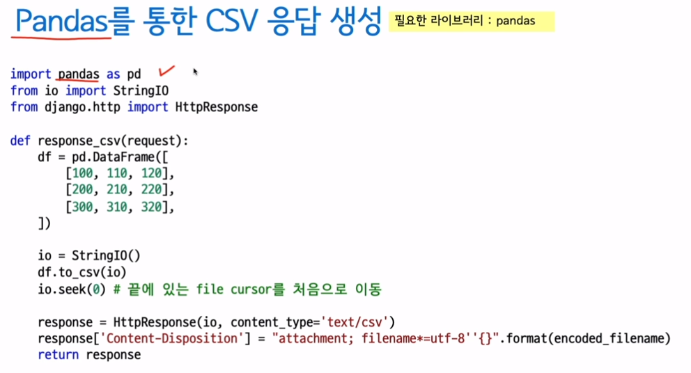
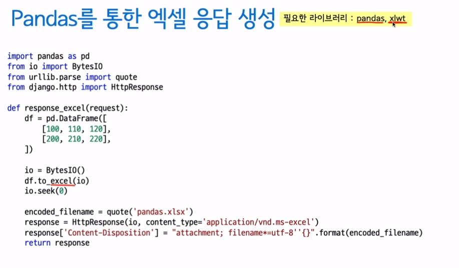

# ch04) 장고 Views
**01- 다양한 응답의 함수 기반 뷰(1)**

* View

1개의 HTTP 요청에 대해 1개의 뷰가 호출 됨

urls.py/urlpatterns 리스트에 매핑된 호출 가능한 객체

웹 클라이언트로부터 HTTP 요청을 처리

크게 2가지 형태의 뷰

함수 기반 뷰 (Function Based View): 장고 뷰의 기본

-> 호출 가능한 객체, 그 자체

클래스 기반뷰(Class Based View)

-> 클래스.as_view() 를 통해 호출가능한 객체를 생성/리턴

**View 호출 시, 인자**

HttpRequest 객체 및 URL Captured Values

1번째 인자: HttpRequest 객체

-> 현재 요청에 대한 모든 내역을 담고 있다.

2번째~ 인자: 현재 요청의 URL로부터 Capture된 문자열들

url/re_path를 통한 처리에서는 -> 모든 인자는 str 타입으로 전달

path를 통한 처리에서는 -> 매핑된 Converter의 to_python에 맞게 변환된 값이 인자로 전달

**View 호출에 대한 리턴 값**

- 필히 HttpResponse 객체를 리턴해야 한다.

장고 Middleware에서는 뷰에서 HttpResponse 객체를 리턴하기를 기대함 -> 다른 타입을 리턴하면 Middleware에서 처리 오류

django.shortcut.render 함수는 템플릿 응답을 위한 shortcut함수

- 파일 like 객체 혹은 str/bytes 타입의 응답 지원

str 문자열을 직접 utf8로 인코딩할 필요가 없다.

장고 디폴트 설정에서 str 문자열을 utf8로 인코딩해준다.

**02- 다양한 응답의 함수 기반 뷰(2)**

- 다양한 타입의 HttpResponse

**Excel 파일 다운로드 응답**

파일객체를 그대로 전달하면 된다.

**pandas를 통한 CSV 응답 생성**

**pandas를 통한 엑셀 응답 생성**

**pillow를 통한 이미지 응답 생성 - 기본**

**pillow를 통한 이미지 응답 생성 - View**

**03- URL Dispatcher와 정규 표현식**

* URL Dispatcher

특정 URL 패턴 -> View의 List

프로젝트 /settings.py에서 최상위 URLConf모듈을 지정

HTTP요청이 들어왔을 때, 등록된 urlpatterns상의 매핑 리스를 **처음부터 순차적**으로 훑으며 URL매칭을 시도

-> 매칭이 되는 URL Rule이 다수 존재하더라도, 제일 처음 만나는 Rule에만 적용됨.

-> 매칭되는 URL Rule이 없으면, 404 Page Not Found 응답을 발생

* path()와 re_path()의 등장

django.urls.re_path() -> Django.conf.urls.url()과 동일

Django.urls.path() -> 기본 지원되는 Path converters를 통해 정규표현식 기입이 간소화(만능은 아님!)

-> 자주 사용되는 패턴을 Converter로 등록하면 재활용면에서 편리하다.

* 기본 제공되는 Path Converters

IntConverter

StringConverter

UUIDConverter

SlugConverter (StringConverter 상속)

PathConverter (StringConverter 상속)

* 정규 표현식

거의 모든 프로그래밍 언어에서 지원

문자열의 패턴, 규칙, Rule 을 정의하는 방법

문자열 검색이나 치환작업을 간편하게 처리

장고 URL Dispatcher에서는 정규표현식을 통한 URL 매칭

* 커스텀 Path Converter

-> instagram/urls.py 실습 진행

**04- 클래스 기반 뷰 시작하기**

* View

함수 기반 뷰(Function Based View)

-> View 구현의 기본! FBC로 구현할 줄 알아야 응용이 가능하다.

공통기능들은 장식자 문법으로 적용

클래스 기반 뷰(Class Based View)

공통 기능들은 상속 문법으로 적용

* Class Based View

**View 함수를 만들어주는 클래스**

as_view()  클래스 함수를 통해 view 함수를 생성

상속을 통해, 여러 기능들을 믹스인

**CBV 컨셉 구현해보기**

\#1. FBV

\#2. 함수를 통해, 동일한 View 함수 생성

\#3. Class로 동일한 View 함수 구현

\#4. 장고 기본 제공 CBV 활용

**CBV는 정한 관례대로 개발할 경우, 아주 적은 양의 코드로 구현 가능**

그 관례에 대한 이해가 필요 -> FBV를 통한 개발 경험이 큰 도움.

**05- 장고 기본 CBV API (Base Views)**

- Built-in CBV API

**Base views**

- View

모든 CBV의 모체, 직접 사용할 일은 x

http method별로 지정이름의 멤버함수를 호출토록 구현

- TemplateView

ContextMixin

TemplateResponseMixin: 직접 사용x 

TemplateView

- RedirectView

**Generic display views**

**Generic date views**

**Generic editing views**

**06- 장고 기본 CBV API (Generic display views) (1)**

1. DetailView

<- SingleObjectTemplateResponseMixin

<- BaseDetailView

1개 모델의 1개 object에 대한 템플릿 처리

모델명 소문자 이름의 Model Instance를 템플릿에 전달

CBV의 DetailView에서 get_queryset 커스텀

**07- 장고 기본 CBV API (Generic display views) (2)**

2. ListView

<- MultipleObjectTemplateResponseMixin

<- BaseListView

1개 모델에 대한 List 템플릿 처리

모델명소문자_list 이름의 QuerySet을 템플릿에 전달

페이징 처리 지원

**08- 장고 기본 CBV API (Generic display views) (3)**

django bootstrap4(https://django-bootstrap4.readthedocs.io/en/latest/#)    

설치   

pip install django-bootstrap4   

   

사용

09- 뷰 장식자