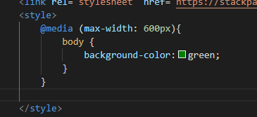
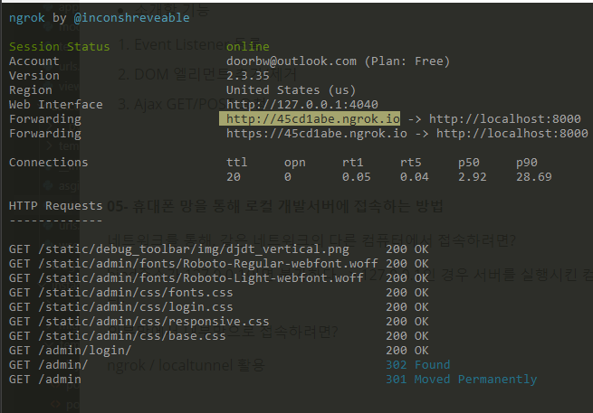

# ch05) 웹 프론트엔드 기초 및 장고 static
**01- Overview **  

* 웹 프론트엔드를 위한 3가지 언어

HTML: 웹페이지의 내용 및 구조   

CSS: 웹페이지의 스타일   

JavaScript   

   

* 웹 프론트엔드와 백엔드

웹 개발은 크게 백엔드와 프론트엔드 개발로 나눠진다. 장고는 백엔드에 초점이 맞춰진 웹 프레임워크이다. 2가지를 모두 한번에 잘할 수는 없다.   

   

단지 하나의 HTTP요청에 대해서 하나의 응답(response)를 받는다.   

   

**02- CSS Layout (1) **  

과거에는 Table for Layout -> 지금은 CSS for Layout   

   

**반응형 웹**

브라우저의 가로크기에 따라 각기 다른 CSS 스타일을 적용   

CSS Media Queries를 통해 구현   

   

**CSS Frameworks of 2019**   

1. Bootstrap
2. Materialize CSS
3. Semantic UI
4. Material UI
5. UIKit
6. Foundation

   

**CDN**   

최적화된 전세계적으로 촘촘히 분산된 서버로 이루어진 플랫폼   

전 세계의 유저에게 빠르고 안전한 정적파일 전송   

우리는 하나의 원본(Origin)서버를 가지고, CDN 서비스 업체에서는 전 세계에 걸쳐 컨텐츠 서버를 가지고 있고, 원본 서버로부터 각 컨텐츠 서버로 데이터를 복제한다.   

전 세계의 유저들이 동일한 주소로 컨텐츠를 요청하면, CDN서비스에서는 이 요청을 해당 유저와 물리적으로 가까운 CDN 콘텐츠 서버에서 응답토록 구성한다.   

**03- CSS Layout (2)**   

bootstrap cdn 적용 등 실습 위주..   

**04- JavaScript와 jQuery**   

* 소개할 기능   

1. Event Listener 등록
2. DOM 엘리먼트 추가/제거
3. Ajax GET/POST 요청

   

   

**05- 휴대폰 망을 통해 로컬 개발서버에 접속하는 방법**   

네트워크를 통해, 같은 네트워크의 다른 컴퓨터에서 접속하려면?   

bind주소가 127.0.0.1이면 불가하다. -> 127.0.0.1인 경우 서버를 실행시킨 컴퓨터에서만 접속 가능하다.   

외부망에서 내부망으로 접속하려면?   

ngrok / localtunnel 활용   

   

ngrok를 통해 외부망에서 접속.

   

viewport meta태그를 이용해 모바일에서 스케일조정..

   

**06- 장고가 static 파일을 다루는 방법**    

* static 파일.  

개발 리소스로서의 정적인 파일(js, css, image 등).   

앱/프로젝트 단위로 저장/서빙   

   

장고는 One Project, Multi App 구조이다. 하나의 App을 위한 static 파일을 app/static/app 경로에 둔다.   

python manage.py collectstatic   

위와 같은 명령어를 통해 여러 디렉토리로 나눠진 static파일들을 이 경로의 디렉토리로 복사하여, 서빙한다. -> 배포에서만 의미가 있는 설정    

   

