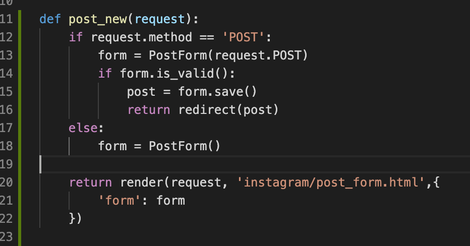
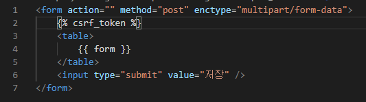

# ch06) 장고 Forms
**01- HTML Form.**   

* 언제 쓰나?

HTML Form(클라이언트 측).   

클라이언트에서 사용자에게 입력폼을 제공하고, **이를 서버로 전송하고자 할 때.**   

Django Form(서버 측).   

**클라이언트로부터 전달받은 값들에 대한 유효성 검사를 수행하고, 이를 데이터베이스에 저장하는 등의 처리.**   

HTML Form을 생성하는 기능 제공, 이를 활용하거나 인터페이스만 맞춰서 직접 HTML Form을 코딩해도 됨.   

   

* HTML Form.   

\<form>\</form>태그를 통해 입력폼을 구성한다.   

submit 시에 지정된 action URL로 데이터 전송을 시도한다.   

* HTML \<form> 태그 필수 속성.   

Action: 요청을 보낼 주소.   

Method: 전송 방식.   

​	GET: 주로 데이터 조회 요청 시에 사용, POST: 파괴적인 액션(생성/수정/삭제)에서 사용.   

Enctype: 인코딩 방식.   

​	POST에서만 유효, GET요청에서는 하나의 enctype으로 강제됨.   

   

* 장고 뷰에서의 인자 접근.   

request.GET (GET, POST 모두 사용가능)   

request.POST (POST 에서만 사용 가능)   

request.FILES (POST 에서만 사용 가능)   

   

**02- HttpRequest와 HttpResponse**   

* HttpRequest 객체

클라이언트로부터의 모든 요청 내용을 담고 있다.    

함수 기반 뷰: 매 요청 시마다 뷰 함수의 첫번째 인자 request로 전달.   

클래스 기반 뷰: 매 요청 시마다 self.request를 통해 접근.   

* Form 처리 관련 속성들

.method: 요청의 종류 "GET" 또는 "POST"로서 모두 대문자.   

.GET: GET인자 목록(QueryDict타입).   

.POST: POST인자 목록(QueryDict타입).   

.FILES: POST인자 목록(MultiValueDict타입).   

   

* MultiValueDict: 동일 Key 다수 Value.   

   

* HttpResponse

다양한 응답을 Wrapping: HTML문자열, 이미지 등등,,,   

View에서는 반환값으로 HttpResponse 객체를 기대.   

   

* JsonResponse

* StreamingHttpResponse

효율적인, 큰(긴) 응답을 위한 것.(혹은 메모리를 많이 먹는 응답).   

-> iterator를 통해 큰 응답을 잘라서 처리하는 것.   

* FileResponse

StreamingHttpResponse를 상속 받는다.   

Content-Length, Content-Type, Content-Disposition 헤더 자동 지정.   

   

**03- Form**    

장고를 더욱 장고스럽게 만들어주는 주옥같은 Feature.   

주요역할!    

- 입력폼 HTML 생성
- 입력폼 값에 대한 유효성 검증 (Validation) 및 값 변환
- 검증을 통과한 값들을 dict형태로 제공

   

* Django 스타일의 Form 처리 (1)

하나의 URL(하나의 View)에서 2가지 역할을 모두 수행.   

1. 빈 폼을 보여주는 역할과(GET)
2. 폼을 통해 입력된 값을 검증하고 저장하는 역할(POST)

   

   

**04- Cross Site Request Forgery**

CSRF 공격: 사용자가 의도하지 않게 게시판에 글을 작성하거나, 쇼핑을 하게 하는 등의 공격   

-> 공격을 막기 위해 Token을 통한 체크(POST요청에 한해 CsrfViewMiddleware를 통한 체크)   

위와 같이 csrf_token을 이용하면 된다.   

CSRF Token 는 유저인증Token 이나 JWT(JSON Web Token)이 아니다.   

   

CSRF Token 기능은 끄지않는다!!!   

앱 API에서는 끈다..!   

django-rest-framework의 APIView에서는 csrf_exempt가 적용되어있다.    

   

05- ModelForm   

06- Form Validation   

07- Messages Framework   

08- Form을 통한 삭제 구현   

09- 장고 기본 CBV API (Generic editing views)   

