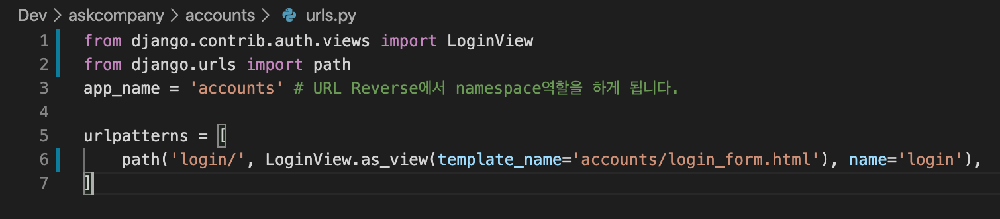
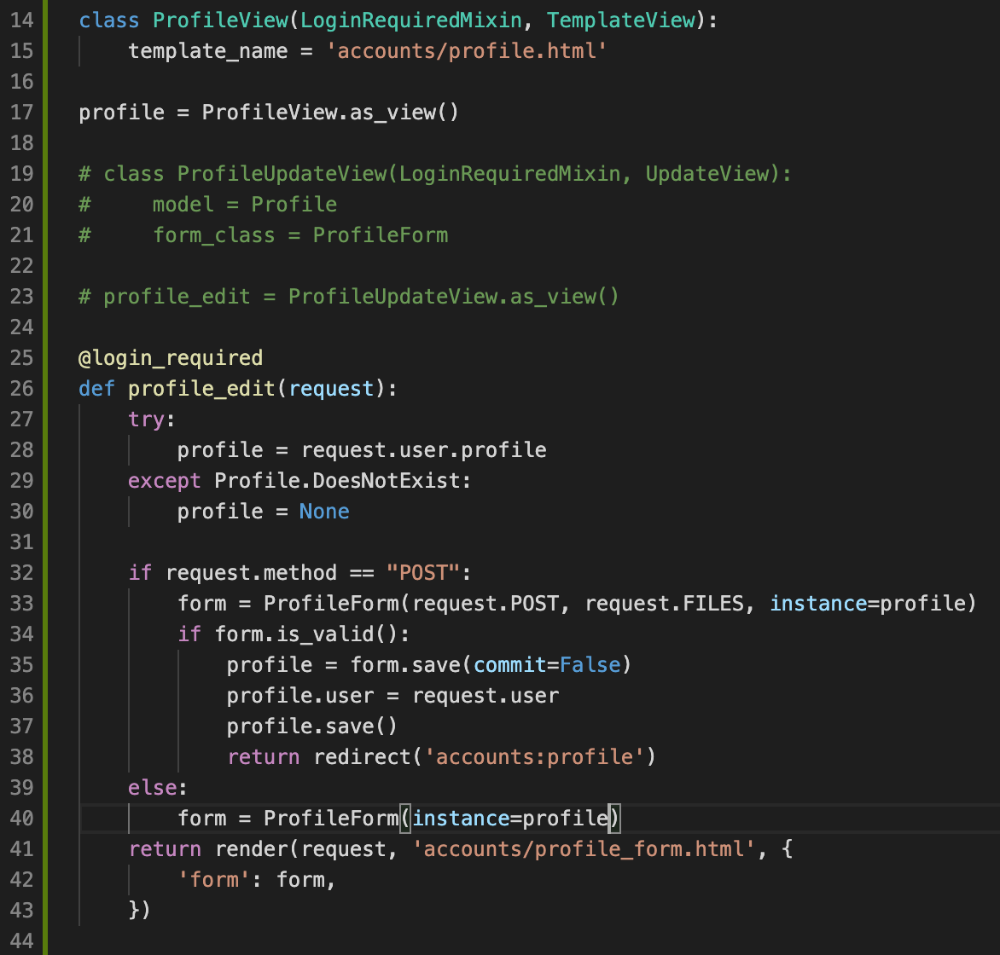
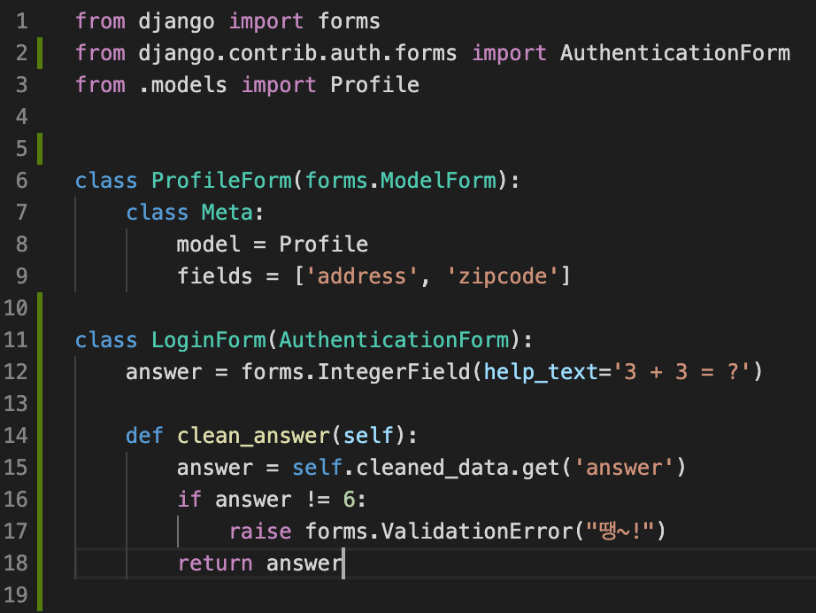
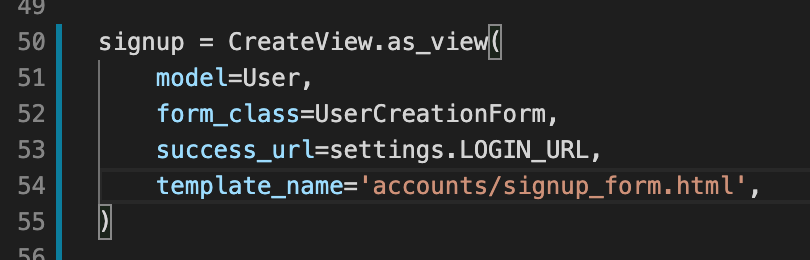
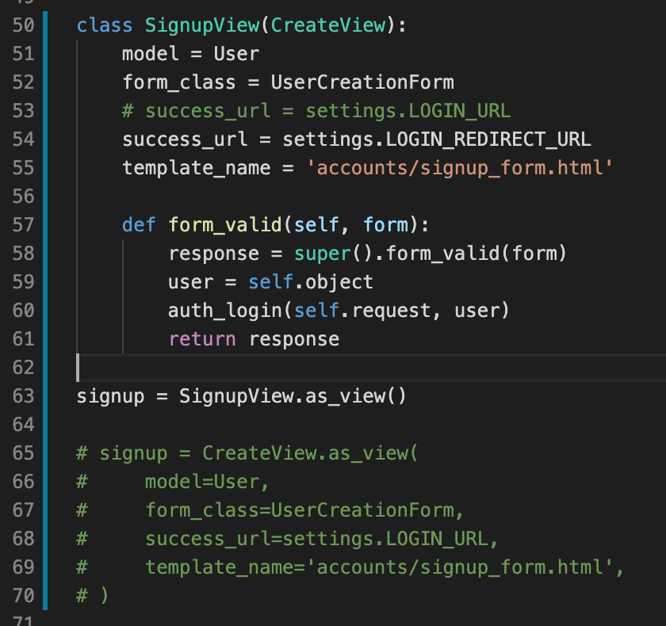

# ch07) 장고 기본 인증
**01- 로그인 처리.**   

LoginView 사용하여 CBV방식으로 구현.   

​    

**02- 사용자 프로필 페이지 및 프로필 수정.**   

위의 profile_edit는 함수기반뷰로 만듬.

   

**03- 템플릿 레이아웃에 링크 추가하기.**   

로그인, 로그아웃 버튼 추가하기!    

우선 layout.html 에 url태그로 링크만 걸어줌.    

   

**04- 퀴즈를 맞춰야 로그인.**   

AuthenticationForm 이 클래스를 상속 받아서 퀴즈 만듦!   

   

**05- 회원가입.**   

장고 user app에 UserCreationForm이 있다.   

   

**06- 회원가입하자마자 로그인하기.**   

위와 같이 기존의 CreateView를 상속받아서 처리해야 한다.   

실제 장고쪽의 로그인 코드를 보면    

from django.contrib.auth import get_user_model, login as auth_login    

와 같이 login을 import 해서 해당 함수로 실제 로그인 처리를 함을 알 수 있다.    

따라서 동일하게 import 하여 사용한다.    

   

**07- 로그아웃 처리.**   

next_page인자를 이용해서, 로그아웃 이후에 어느 화면으로 갈지 설정해둘 수 있다.   

또는 LOGOUT_REDIRECT_URL을 settings.py에 설정해둘 수 있음.   

next인자는 로그인/로그아웃화면 이후 어느 화면으로 갈지를 미리 설정해두는 것.   

   