# ch08) 비SPA방식으로 장고 Forms/Views를 적극 활용한 인스타그램 St 만들기
**01- Overview**   

* 이번 챕터에서 만들어볼 내용

-> 새로운 프로젝트를 만들어 볼 것!   

회원가입/로그인/프로필 수정 및 암호 수정/포스팅 쓰기 구현/유저 페이지 구현/타임라인   

SPA: Single Page Application -> HTML/CSS/JavaScript의 비중이 커진다.   

   

**02- 프로젝트 생성 및 초기 프로젝트 환경 설정**   

새로운 가상환경세팅   

conda create --name=django-with-react-rev2 python=3.8   

   

장고 환경 구성에 있어서, requirements와 settings를 개발/운영으로 나누어 만들어 두었음.   

이때 settings 변경에 따라 manage.py, asgi.py, wsgi.py 세가지 파일에서 기존의 settings.py 보는 경로를 수정해주어야함.   

   

**03- Bootstrap4를 활용한 기본 레이아웃 구현**   

bootstrap4를 다운받아서 프로젝트 폴더 static에 넣어줌.    

-> bootstrap4를 이용하여 기본 레이아웃(layout.html) 구현.   

   

**04- 커스텀 유지 저징 및 회원가입 구현**   

* 회원가입 구현.   

1. 커스텀 유저.   

signupform을 이용하여 회원가입 구현.   

-> UserCreationForm 을 이용하여 패스워드가 암호화 된 후 저장되도록 함.   

2. 아이디/암호/이메일/이름.   

Forms 에서 Meta를 작성할때, UserCreationForm의 Meta를 오버라이트하기위해 UserCreationForm.Meta를 상속받아서 진행한다.   

아래는 forms.py    

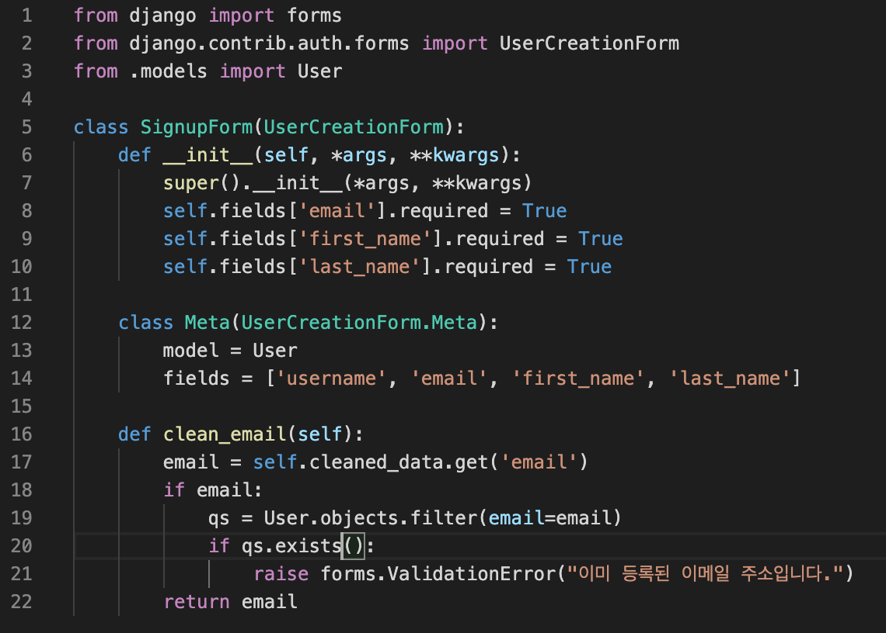

   

**05- 회원 가입 환영 이메일 보내기**   

방법#1) 장고 기본의 send_mail API 활용(SMTP).   

-> sendgrid에서 제공하는 방법을 활용.(https://sendgrid.com/docs/for-developers/sending-email/django/).   

방법#2) django-sendgrid-v5 활용하여, 전용 WEB API 활용.   

   

아래와 같이 templates에 txt파일에도 인자를 던질 수 있다.   

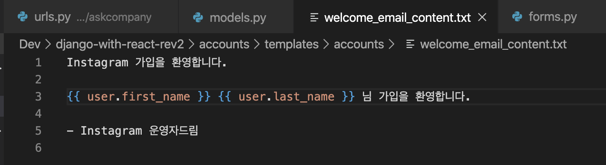

​    

**06- SendGrid API Key  획득하고 환경변수에 저장하기**   

Sendgrid api key를 획득하는 방법에 대해서...    

   

**07- 로그인-로그아웃 구현 그리고 회원 가입과 동시에 로그인**   

from django.contrib.auth.views import LoginView   

위를 통해 LoginView 라는 클래스기반 뷰를 이용한다.   

이후 로그아웃 기능 구현.   

-> 로그아웃과 동시에 로그인 화면으로 가기 위해 logout_then_login 이라는 CBV이용.   

이후 회원가입과 동시에 로그인 기능 구현.   

from django.contrib.auth import login as auth_login 을 통해서 signup 함수에서 user저장 후 로그인 처리.   

   

**08- django-pydenticon을 활용하여 프로필 디폴트 이미지 구현**   

Identicons 활용!   

-> 장고에서는 여기, https://github.com/azaghal/django-pydenticon.   

현재 해당 라이브러리의 url patterns에 오류가 있어서, views를 가져와 따로 사용한다.!    

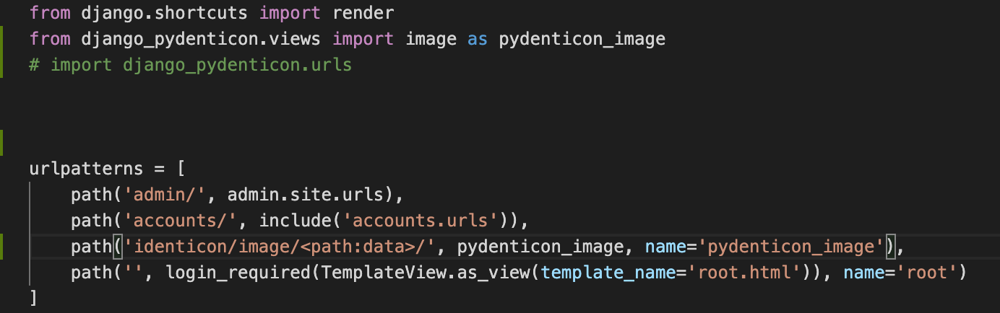

   

**09- 프로필 수정 구현과 장고3에서 추가된 TextChoices 활용**   

CharField 필드에서 choices옵션을 줄 수 있다.   

-> 장고3버전부터는 TextChoices 클래스를 만들어서 설정할 수 있다.   

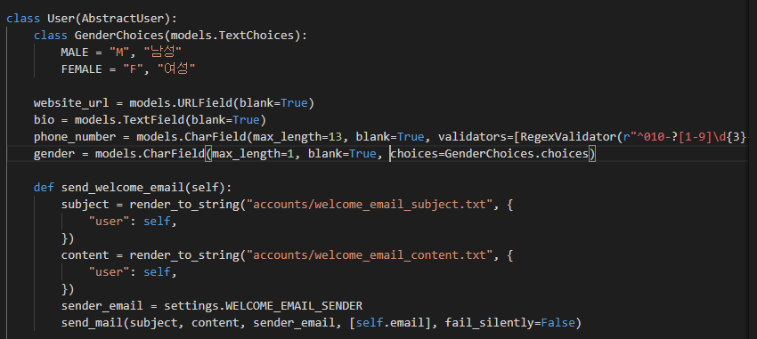

이후 사진 업로드까지 구현.    

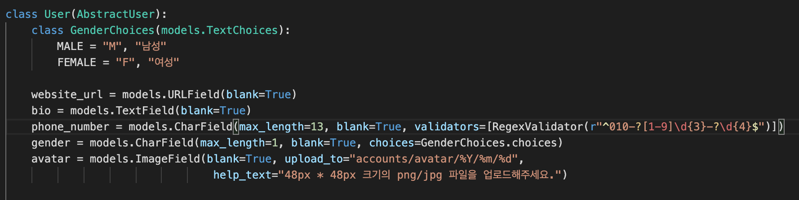

파일 업로드 구현.(위 코드의 avatar 필드)   


**10- auth앱의 PasswordChangeForm 커스텀을 통한 암호 수정 구현**    

장고 auth를 보면 PasswordChangeView 등이 있다.   

PasswordChangeForm은 SetPasswordForm을 상속 받고 있다.   

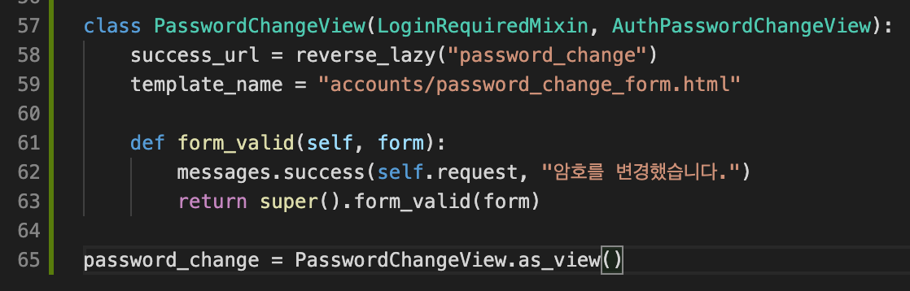

위와 같이 구현하여 암호변경을 완성. 근데 기존암호와 새로운암호를 동일하게 해도 정상적으로 넘어가진다.   

이런걸 변경하기 위해서는 상속받은 것을 수정해줘야 함!   

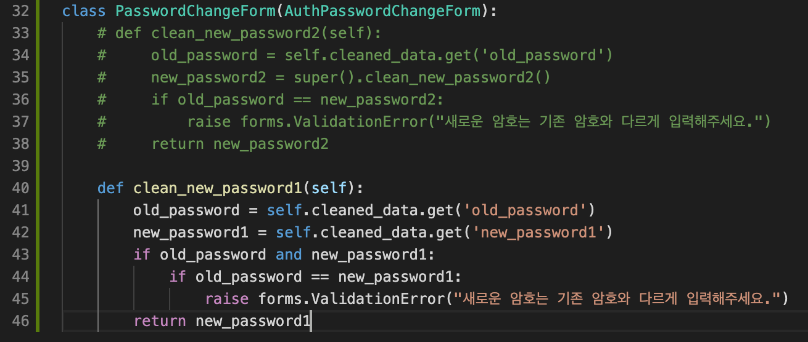

위와 같이 PasswordChangeForm을 AuthPasswordChangeForm이라는 이름으로 가져와서 내부 clean_new_password2 함수를 새로 정의해주었다.   

   

**11- instagram 앱 생성과 포스팅 쓰기 구현**   

포스팅 쓰기 구현 -> 사진1장, caption과 태그 쓰기, location.   

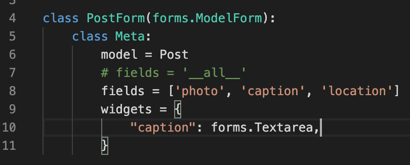

Forms 구현에서 widgets를 통해 스타일을 바꿀 수 있다.    

   

caption 내용에 \#으로 담긴 태그를 빼와서 실제 tag_set에 넣어주자!   

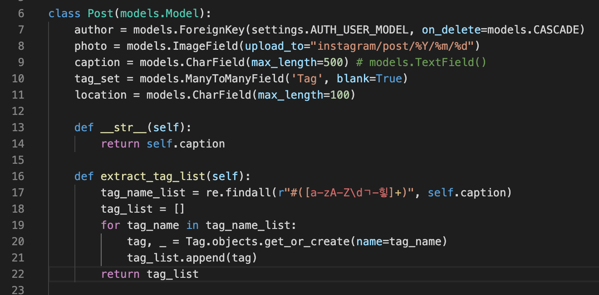

정규표현식을 이용해서 extract_tag_list 함수 구현!   

이를 이용한 포스팅쓰기 함수.   

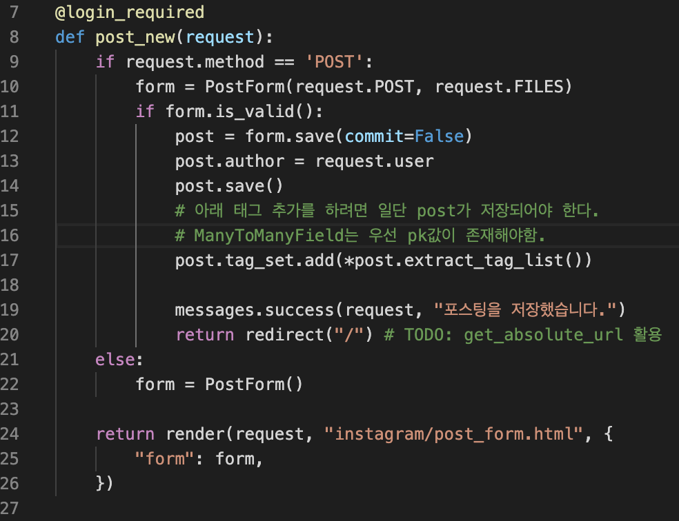

   

**12- instagram post_detail 뷰 구현**   

특정 모델에 대한 detail 뷰를 구현하면, model 함수에 아래와 같이 get_absolute_url을 구현하는 것을 추천!   

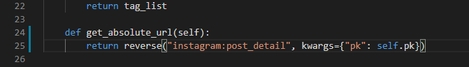

   

**13- 유저 페이지 구현**   

User_page 구현.   

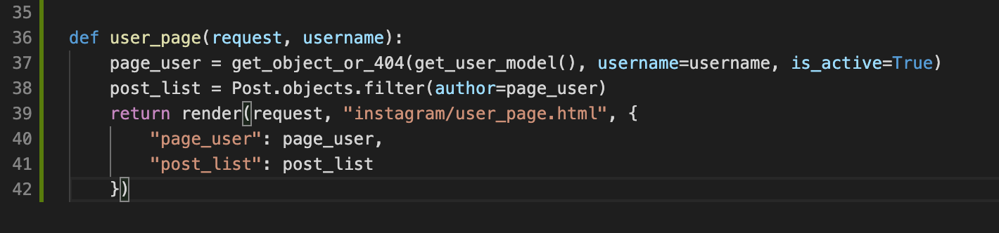

   

**14- easy-thumbnails를 활용한 유저페이지 썸네일 처리 구현**   

Easy-thumnails 라이브러리 활용.   

   

**15- Timeline sidebar 템플릿 및 스타일 구현**   

부트스트랩을 이용해 스타일 구현.   

   

**16- User 모델에 Follow-Unfollow 관계 필드를 구현하고, Follow 기능 구현**   

Follow 기능 구현 -> User모델에 ManyToMany필드 추가   

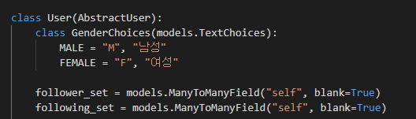

위와 같이 "self" 를 통해서 자기 자신을 참조하게 한다.   

```python manage.py sqlmigrate 앱이름```

위 명령어를 통해서 migrate시 쿼리를 볼 수 있다.   

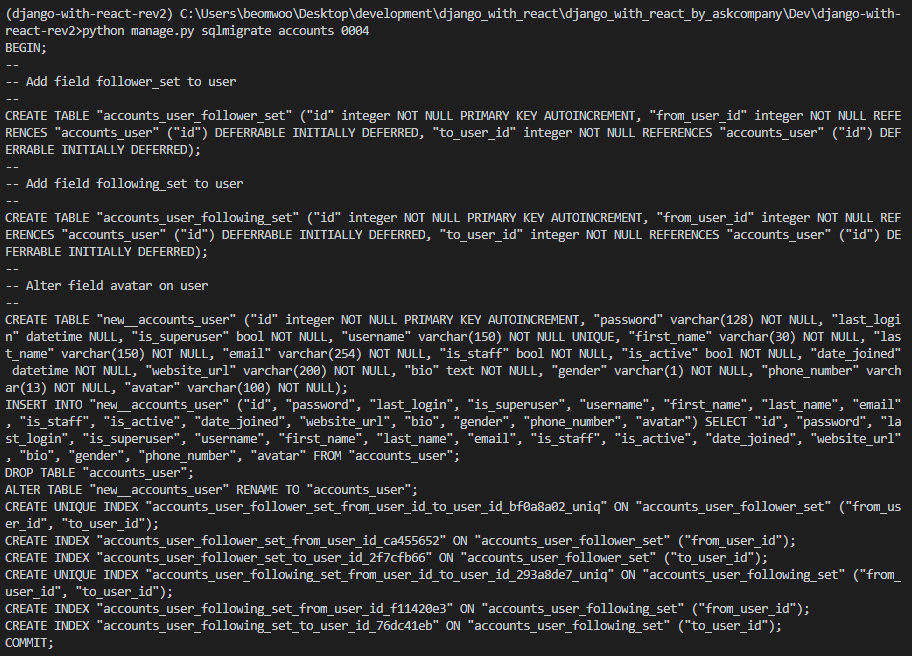

   

follow, unfollow 기능 구현.   

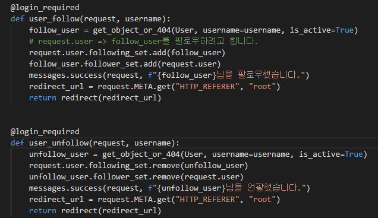

   

ORM코드로 팔로우 한 사람은 추천목록에 안보이게 하기!   

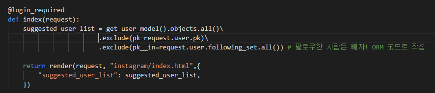

   

for문에서 empty 구문 사용가능.   

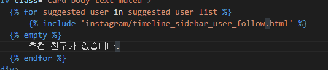

   

**17- Timeline에 Follow하는 유저들의 포스팅 만을 노출**   

filter 등에서 OR 조건 사용하기 -> from django.db.models import Q   

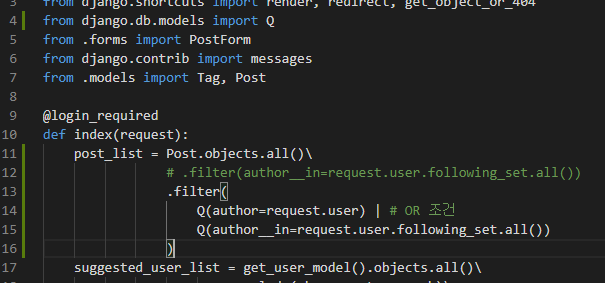

   

**18- 유저페이지에서 Unfollow 구현**   

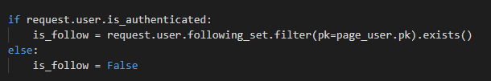

is_follow 를 통해, 각 유저 페이지에 해당 인원에 대한 팔로우 언팔로우 기능 구현.   

   

**19- Timeline 포스팅 목록 조건에 날짜 범위 지정하기**   

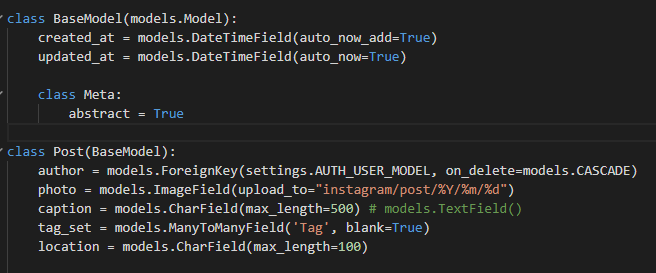

위와 같이 BaseModel(추상모델)을 구현해서 상속으로 사용할 수 있다.   

이렇게 시간 필드를 넣어주고,   

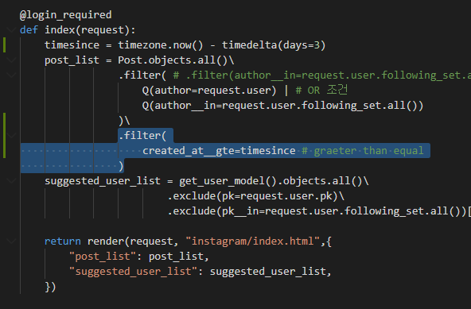

위와 같이 filter를 통해 날짜범위를 지정하여 객체를 가져오도록 한다.   

   

20- 포스팅 좋아요-취소 구현

21- 장고만으로 댓글 쓰기 구현

22- 자바스크립트없이 포스팅 화면에서 댓글 쓰기

23- 장고 위주로 jQuery를 통한 Ajax 댓글 쓰기 구현

