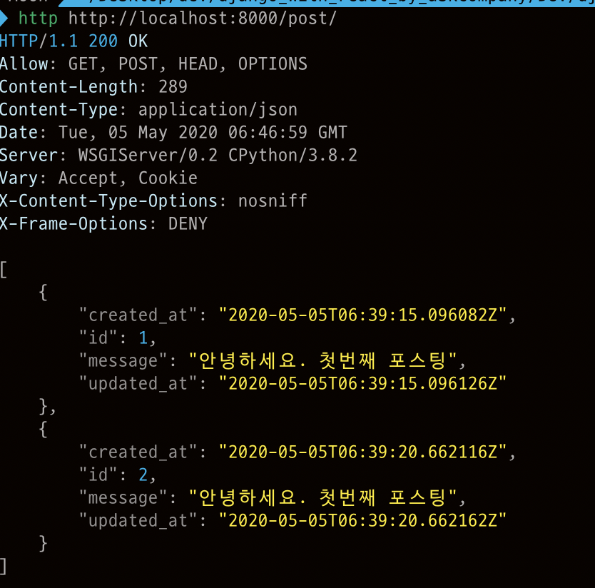
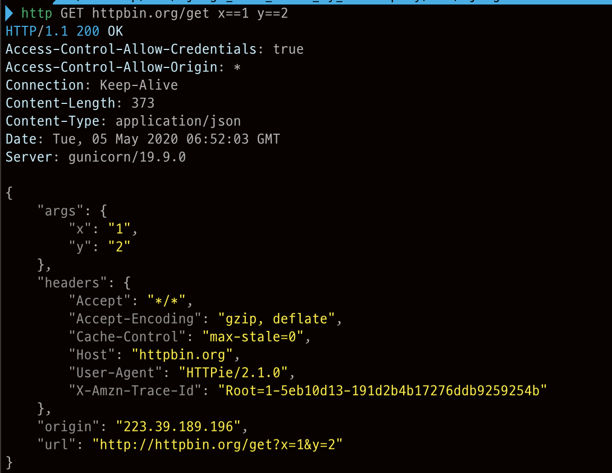
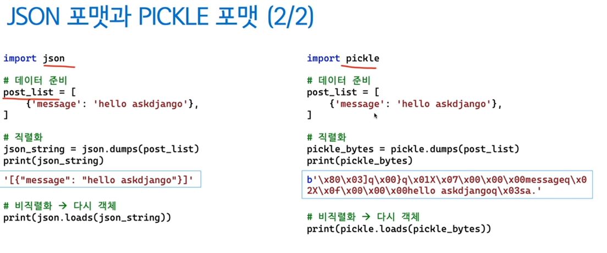

# ch09) 장고 django-rest-framework(이하DRF)를 활용한 효율적인 웹 API 만들기
**01- API 서버와 REST**    

API서버란? 앱/웹 서비스를 만드는 개발자들이 이용하는 데이터 위주의 서비스!   

시간이 지나도 호환성을 유지해야 한다.   

data -> 과거에는 xml을 많이, 요즘은 json을 많이 사용한다.   

REST(Representational State Transfer).   

아키텍처 스타일. 프로토콜에 독립적 -> 일반적인 REST 구현에 HTTP를 많이 사용한다.   

RESTful API의 몇가지 디자인 원칙.   

1. 리소스(data)를 중심으로 디자인.
2. 클라이언트에서 액세스할 수 있는 모든 종류의 개체/서비스가 리소스에 포함
3. 리소스마다 해당 리소스를 고유하게 식별하는 식별자
4. 요청/응답 포맷으로 흔히 JSON을 사용
5. 균일한(uniform) 인터페이스를 적용. 리소스에 표준 HTTP 동사 (GEP, POST, PUT, PATCH, DELETE)를 적용

   

Django-rest-framework : 서드파티 라이브리러 중에 하나임.   

- 주요기능들!

Serializer/ModelSerializer를 통한 데이터 유효성 검증 및 데이터 직렬화.  

각종 Parser를 통한 데이터 처리.   

APIView/Generic/ViewSet/ModelViewSets를 통한 요청 처리.   

각종 Renderer를 통한 다양한 응답 포맷 지원.   

인증(Authentication)/권한(Permission) 체계 - 서드파티를 통해 JWT지원.   

Throttling(최대 호출 회수 제한).   

   

**02- JSON 응답뷰 만들기**   

Djangorestframework 설치 후 실습!   

* 다양한 HTTP 클라이언트 프로그램

유저가 웹브라우저를 통해 웹페이지 간 이동을 할 때,   

웹 프론트엔드에서 JavaScript를 통한 호출.   

Android/iOS 앱 코드를 통한 호출.   

웹 요청 개발 프로그램을 통한 호출.   

-> GUI 프로그램: Postman.   

-> CLI 프로그램: cURL, HTTPie.   

-> 라이브러리: requests.   

이 중에 HTTPie를 사용해서 실습 진행!    

   

http --json POST 요청할주소 GET인자명==값 POST인자명=값   

위와 같은 식으로 요청 방식, method, 인자 모두 컨트롤 가능함.    

​    

httpbin.org 사이트에 요청을 보내보면서 테스트해볼 수 있음!   

   

**03- JSON 직렬화**   

직렬화(Serialization): 모든 프로그래밍 언어의 통신에서 데이터는 필히 문자열로 표현되어야 한다.   

각 언어에서 모두 지원하는 직렬화 포맷(JSON, XML)도 있고, 특정 언어에서만 지원하는 직렬화 포맷(파이썬은 Pickle)이 있다.   

json/pickle 모두 파이썬 기본 라이브러리 -> 장고 타입(Model/QuerySet 등)에 대한 직렬화 Rule은 없다!   

   

04- APIView를 활용한 뷰 만들기

05- mixins 상속을 통한 APIView 로직 재사용

06- ViewSet과 Router

07- Renderer를 통한 다양한 응답 포맷 지원

08- Form과 Serializer 관점에서 DRF 비교

09- Serializer를 통한 유효성 검사 및 저장

10- Authentication과 Permission